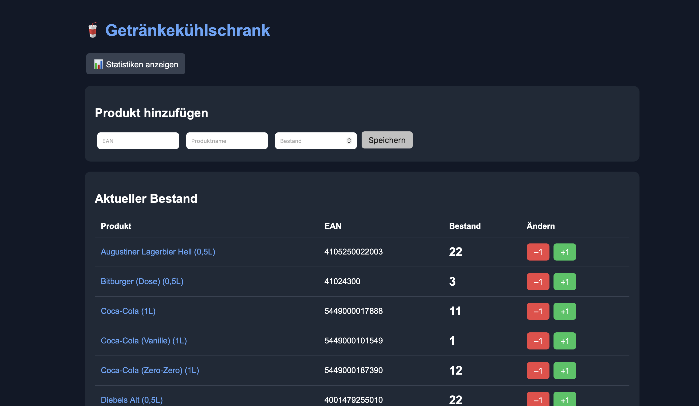
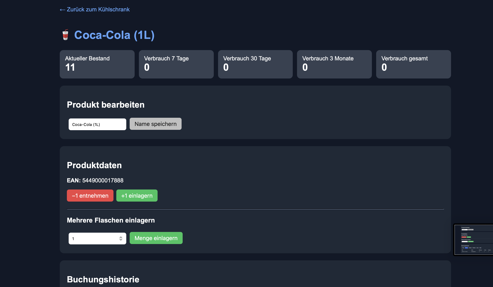
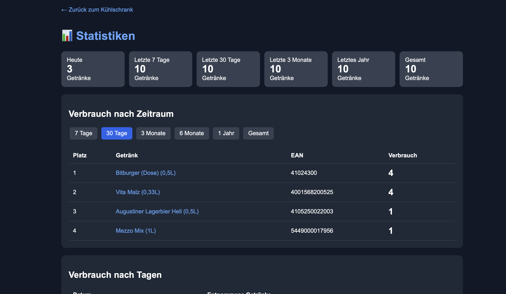

# Smart Drink Fridge

Smart Drink Fridge is a Raspberry Pi based inventory system for a drink fridge.

The idea is simple: Add your drinks and their EAN/barcodes to the system. When you take a bottle or can from the fridge, hold the barcode in front of the camera. The scanner detects the barcode, reduces the stock by one and saves the transaction with a timestamp.

The current stock and transaction history can be viewed through a local web interface.

## Screenshots

### Overview



### Product details



### Statistics



## Features

- Barcode scanning using a camera
- Automatic stock tracking
- Buzzer feedback after a successful scan
- Web interface for managing drinks and inventory
- Add multiple bottles or cans to stock at once
- Transaction history with timestamps
- Filter transactions by product/EAN
- Password-protected cancellation of scanner transactions
- Consumption statistics for different time periods
- Optional Pushover notifications for low stock
- SQLite database
- Docker support

## Hardware

The project was originally built using a Raspberry Pi and a USB camera.

You will need:

- Raspberry Pi or another compatible Linux system
- 1080p USB camera
- Optional GPIO buzzer
- Network connection

A 1080p camera is recommended for reliable barcode detection. During development, the lower-resolution Raspberry Pi camera used in the original setup did not provide sufficient image quality for reliable barcode scanning.

## Docker

Clone the repository and create your configuration file:

```bash
cp .env.example .env
```

Edit `.env` and enter your configuration:

```env
PUSHOVER_USER=
PUSHOVER_TOKEN=
STORNO_PASSWORT=change-me
```

Start the web interface:

```bash
docker compose up -d
```

To also start the barcode scanner service with camera and GPIO support:

```bash
docker compose --profile scanner up -d
```

The web interface should then be available on port 5000:

```text
http://YOUR-RASPBERRY-PI-IP:5000
```

The database is automatically created on the first start and stored in a persistent Docker volume.

## Camera

The default Docker configuration expects a camera at:

```text
/dev/video0
```

If your camera uses another device, change the device path in `docker-compose.yml`.

A 1080p USB camera is recommended. Reliable barcode detection depends on image quality, lighting and the distance between the camera and barcode.

## Buzzer

A GPIO-connected buzzer can be used as acoustic feedback when a barcode is successfully scanned.

The default configuration uses:

- Buzzer positive (+): GPIO 17 (BCM), physical pin 11
- Buzzer negative (-): GND, for example physical pin 9

The GPIO pin can be changed in `scanner.py` if required.

GPIO access inside Docker may require additional configuration depending on the Raspberry Pi model and operating system.

The scanner can also be used without a buzzer after removing or disabling the corresponding GPIO configuration.

## Pushover notifications

Pushover support is optional.

If configured, the system sends a notification when the stock of a product changes from 4 to 3.

Configure your credentials in `.env`:

```env
PUSHOVER_USER=your_user_key
PUSHOVER_TOKEN=your_application_token
```

If you do not want to use Pushover, leave these values empty.

## Database

The project uses SQLite.

A new and empty database is created automatically on the first start. Products and transaction data are stored in the persistent data volume.

No database containing products or personal inventory data is included in this repository.

## Security

Do not commit your `.env` file, database, passwords, API tokens or private keys.

Scanner transactions can be cancelled through the web interface using the password configured with `STORNO_PASSWORT`.

## Project status

This project was originally created for my own drink fridge and is still being developed and improved.

If you find a bug or have an idea for an improvement, feel free to open an issue.

## Support

If you find the project useful and want to support its development, you can send a donation to one of these addresses:

- Bitcoin (BTC): `bc1qvmjpzz2h4wvl3z567d38p9jf2wuw3l5jegnyd9`
- Ethereum (ETH): `0xa65cCd30AD34c2CD312de2f34409474b82b60Aab`
- Solana (SOL): `81cWeiuwBcqSX33m83ELqxdqDbeBcke6o2MNCxeSND8p`

Thank you for supporting the project.

## License

This project is licensed under the MIT License. See `LICENSE` for details.
