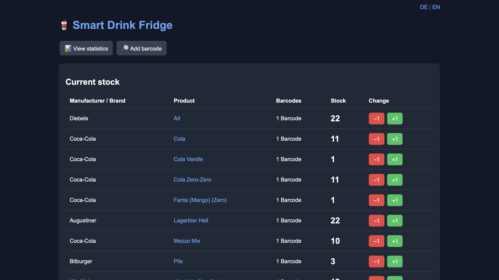
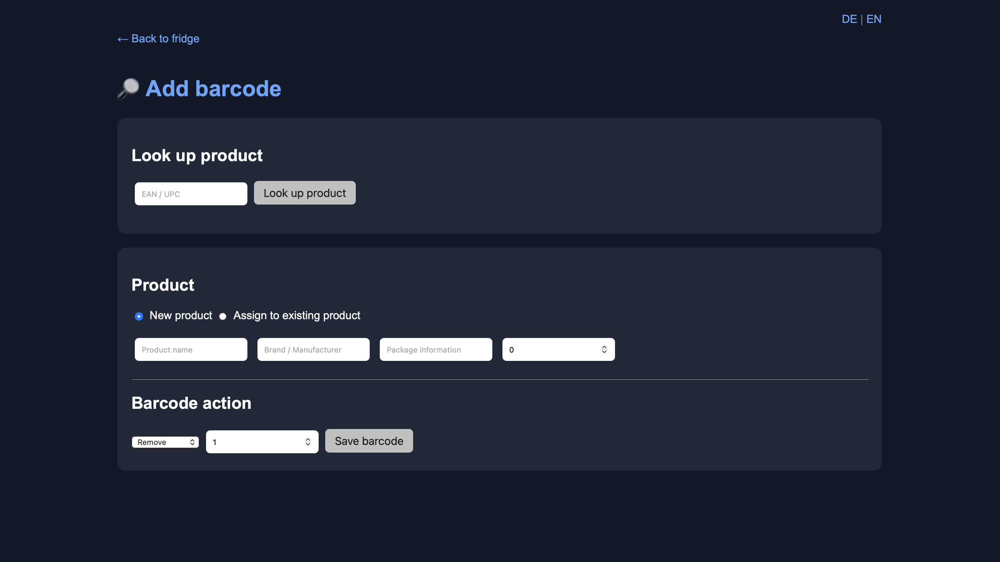
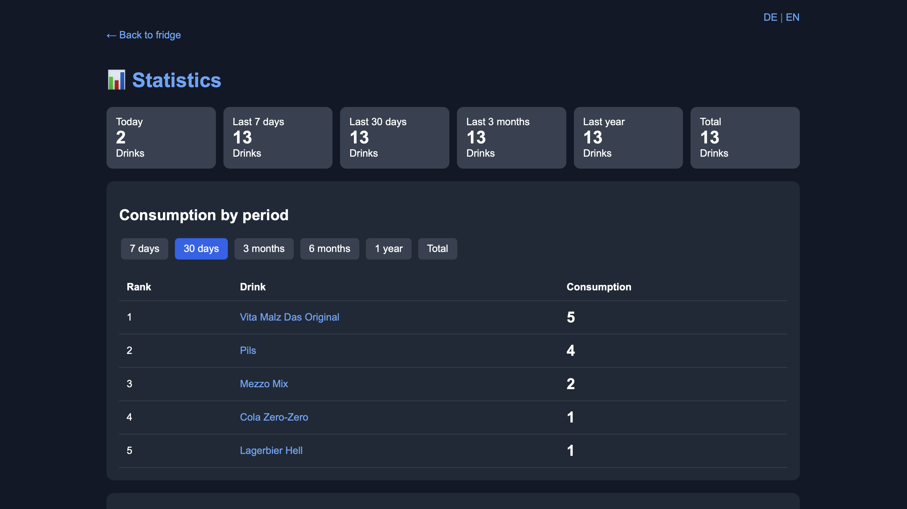
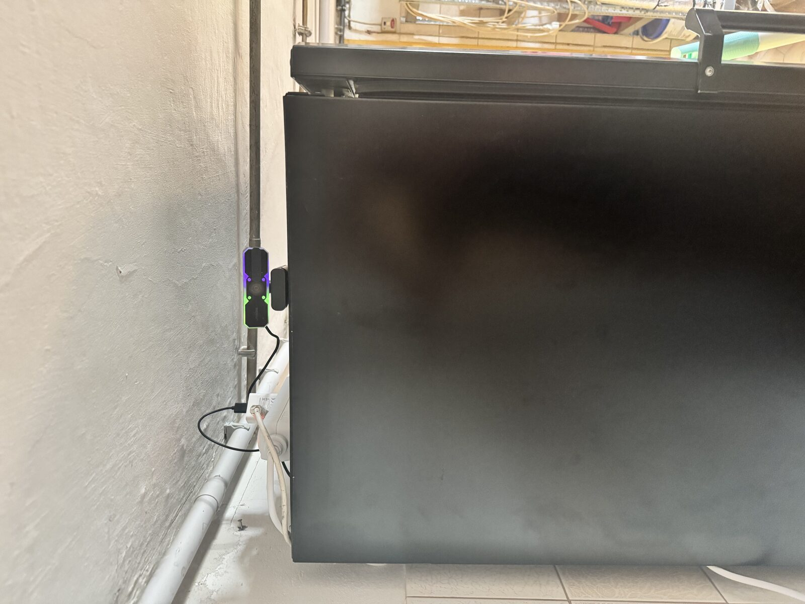
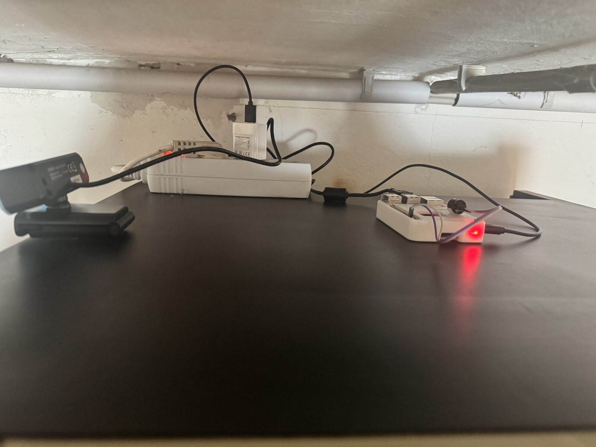

# Smart Drink Fridge

Smart Drink Fridge is a Raspberry Pi based inventory system for a drink fridge.

The idea is simple: Add your drinks and their EAN/barcodes to the system. When you take a bottle or can from the fridge, hold the barcode in front of the camera. The scanner detects the barcode, reduces the stock by one and saves the transaction with a timestamp.

The current stock and transaction history can be viewed through a local web interface.

## Screenshots

### Dashboard



### Add and manage barcodes



### Statistics



## Real-world installation

This is the actual Smart Drink Fridge installation running on a Raspberry Pi.



The Raspberry Pi, USB camera and buzzer are installed directly on top of the fridge.



## Features

- Barcode scanning using a camera
- Automatic stock tracking
- Multiple barcodes per product
- Different actions and quantities per barcode
  - Example: single can barcode -> remove 1 item
  - Example: six-pack barcode -> add 6 items
- Automatic product lookup using Open Food Facts
- Editable product name, manufacturer/brand and packaging information
- Reassign existing barcodes to another product
- Merge duplicate products, including their stock and barcodes
- Automatic stock updates for individual items and multipacks
- Buzzer feedback after a successful scan
- Web interface for managing products, barcodes and inventory
- Add multiple bottles or cans to stock at once
- Transaction history with timestamps
- Product-based transaction history across multiple barcodes
- Password-protected cancellation of scanner transactions
- Correct cancellation of multi-item transactions
- Consumption statistics for different time periods
- German and English web interface
- Optional Pushover notifications for low stock
- Optional Home Assistant integration with automatic shopping list synchronization
- Optional secure remote access using Tailscale
- Optional GitHub update checker with update notifications in the web interface
- SQLite database
- Docker support

## Product and barcode management

Smart Drink Fridge separates products from barcodes.

A single product can have multiple barcodes assigned to it. Each barcode can have its own action and quantity.

Example:

- Single can barcode: remove 1 item
- Six-pack barcode: add 6 items
- 24-pack barcode: add 24 items

This makes it possible to stock a multipack with one scan and later remove the individual bottles or cans one by one using their own barcode.

When adding a barcode, the system can look up product information using Open Food Facts. The returned product name, manufacturer/brand and packaging information are only used as suggestions and can be edited before saving.

Existing barcodes can be reassigned to another product at any time.

Duplicate products can also be merged. Their barcodes and stock are moved to the selected target product.

## Hardware

The project was originally built using a Raspberry Pi and a USB camera.

You will need:

- Raspberry Pi or another compatible Linux system
- 1080p USB camera
- Optional GPIO buzzer
- Network connection

A 1080p camera is recommended for reliable barcode detection. During development, the lower-resolution Raspberry Pi camera used in the original setup did not provide sufficient image quality for reliable barcode scanning.

## Docker

Clone the repository and create your configuration file:

```bash
cp .env.example .env
```

Edit `.env` and enter your configuration:

```env
# Optional Pushover notifications
PUSHOVER_USER=
PUSHOVER_TOKEN=

# Password for cancelling scanner transactions
STORNO_PASSWORT=change-me

# Optional GitHub update checker
UPDATE_CHECKER_ENABLED=true

# Optional Tailscale remote access
TAILSCALE_ENABLED=false
TAILSCALE_AUTHKEY=
TAILSCALE_HOSTNAME=smart-drink-fridge
```

Pushover, the GitHub update checker and Tailscale are optional. Set UPDATE_CHECKER_ENABLED=false to disable update checks. When enabled, the web interface displays the current version status and links to the latest GitHub release when an update is available. Update checks are cached for 6 hours.

Start the web interface:

```bash
docker compose up -d
```

To also start the barcode scanner service with camera and GPIO support:

```bash
docker compose --profile scanner up -d
```

The web interface should then be available on port 5000:

```text
http://YOUR-RASPBERRY-PI-IP:5000
```

The database is automatically created on the first start and stored in a persistent Docker volume.

## Camera

The default Docker configuration expects a camera at:

```text
/dev/video0
```

If your camera uses another device, change the device path in `docker-compose.yml`.

A 1080p USB camera is recommended. Reliable barcode detection depends on image quality, lighting and the distance between the camera and barcode.

## Buzzer

A GPIO-connected buzzer can be used as acoustic feedback when a barcode is successfully scanned.

The default configuration uses:

- Buzzer positive (+): GPIO 17 (BCM), physical pin 11
- Buzzer negative (-): GND, for example physical pin 9

The GPIO pin can be changed in `scanner.py` if required.

GPIO access inside Docker may require additional configuration depending on the Raspberry Pi model and operating system.

The scanner can also be used without a buzzer after removing or disabling the corresponding GPIO configuration.

## Pushover notifications

Pushover support is optional.

If configured, the system sends a notification when the stock of a product changes from 4 to 3.

Configure your credentials in `.env`:

```env
PUSHOVER_USER=your_user_key
PUSHOVER_TOKEN=your_application_token
```

If you do not want to use Pushover, leave these values empty.

## Database

The project uses SQLite.

A new and empty database is created automatically on the first start. Products and transaction data are stored in the persistent data volume.

No database containing products or personal inventory data is included in this repository.

## Security

Do not commit your `.env` file, database, passwords, API tokens or private keys.

Scanner transactions can be cancelled through the web interface using the password configured with `STORNO_PASSWORT`.

## Home Assistant shopping list integration

Smart Drink Fridge can automatically synchronize products that need to be restocked with the Home Assistant shopping list.

### Setup

1. In Home Assistant, create a **Long-Lived Access Token** for your user account.
2. Open **Settings** in the Smart Drink Fridge web interface.
3. In the **Home Assistant** section, enter your Home Assistant URL, for example `http://homeassistant.local:8123`.
4. Enter your **Long-Lived Access Token**.
5. Enable **automatic shopping list synchronization** and save the settings.
6. Configure a **minimum stock level** and **target stock level** for the products you want to synchronize.

When a product reaches or falls below its minimum stock level, Smart Drink Fridge automatically calculates the quantity required to reach the target stock level and adds it to the Home Assistant shopping list.

If the required quantity changes, the shopping list entry is updated automatically. Once the product no longer needs to be restocked, the corresponding entry is removed automatically.

Synchronization tracking is stored persistently in the Smart Drink Fridge database to prevent duplicate shopping list entries.

## What's new in v1.2.2

- Added optional Home Assistant integration.
- Added automatic synchronization with the Home Assistant shopping list.
- Products can now have a minimum stock level and a target stock level.
- When stock reaches or falls below the configured minimum, the required quantity is automatically added to the Home Assistant shopping list.
- Shopping list quantities are automatically updated when stock changes.
- Shopping list entries are automatically removed when the product no longer needs to be restocked.
- Added persistent synchronization tracking to prevent duplicate shopping list entries.
- Home Assistant synchronization runs automatically after inventory changes.
- Added Home Assistant URL and Long-Lived Access Token configuration.
- Existing databases are migrated automatically without deleting product or inventory data.

## What's new in v1.2.1

- Added manufacturer/brand, product type and packaging information throughout the web interface.
- Improved product titles in the current stock overview, statistics and product detail pages.
- Added automatic manufacturer logo lookup using Wikidata and Wikimedia Commons.
- Brand logos are optional: if no matching logo is found or no internet connection is available, the interface continues to work normally without displaying a logo.
- Improved English interface translations, including packaging information.

## Project status

This project was originally created for my own drink fridge and is still being developed and improved.

If you find a bug or have an idea for an improvement, feel free to open an issue.

## Support

If you find the project useful and want to support its development, you can send a donation to one of these addresses:

- Bitcoin (BTC): `bc1qvmjpzz2h4wvl3z567d38p9jf2wuw3l5jegnyd9`
- Ethereum (ETH): `0xa65cCd30AD34c2CD312de2f34409474b82b60Aab`
- Solana (SOL): `81cWeiuwBcqSX33m83ELqxdqDbeBcke6o2MNCxeSND8p`

Thank you for supporting the project.

## License

This project is licensed under the MIT License. See `LICENSE` for details.

## Optional Remote Access with Tailscale

Smart Drink Fridge can optionally use Tailscale to provide secure remote access to the web interface.

Tailscale is completely optional. If disabled, Smart Drink Fridge continues to work locally as normal.

### Configuration

Open your `.env` file and configure:

    TAILSCALE_ENABLED=true
    TAILSCALE_AUTHKEY=your-tailscale-auth-key
    TAILSCALE_HOSTNAME=smart-drink-fridge

You must use your own Tailscale auth key.

Do not share your auth key or commit your `.env` file to GitHub.

To disable Tailscale:

    TAILSCALE_ENABLED=false

### Starting Smart Drink Fridge

Use the included start script:

    ./start.sh

If `TAILSCALE_ENABLED=false`, Smart Drink Fridge starts normally without Tailscale.

If `TAILSCALE_ENABLED=true`, the Tailscale service is started automatically.

After connecting, the Tailscale IP can be displayed with:

    docker exec smart-drink-fridge-tailscale tailscale ip -4

The web interface can then be accessed from another device connected to your Tailnet at:

    http://TAILSCALE-IP:5000

For example:

    http://100.x.x.x:5000

The Tailscale state is stored persistently in a Docker volume, so the device remains registered across container restarts.
