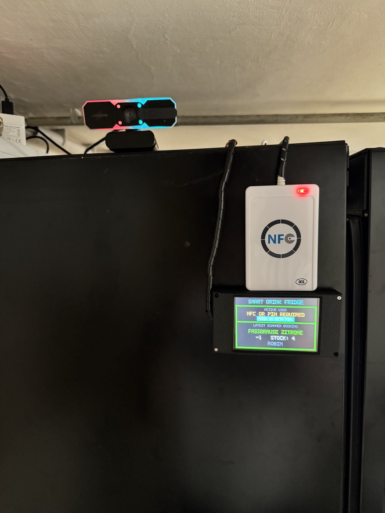

# Smart Drink Fridge

[](https://github.com/DerRobin99/smart-drink-fridge/actions/workflows/docker-publish.yml)
[](https://github.com/DerRobin99/smart-drink-fridge/actions/workflows/app-tests.yml)
[](https://www.codefactor.io/repository/github/derrobin99/smart-drink-fridge)
[](https://codecov.io/gh/DerRobin99/smart-drink-fridge)
[](https://github.com/DerRobin99/smart-drink-fridge/releases/latest)
[](LICENSE)
[](https://www.python.org/)
[](https://github.com/DerRobin99/smart-drink-fridge/pkgs/container/smart-drink-fridge)

Smart Drink Fridge is a Raspberry Pi based inventory system for a drink fridge.

The idea is simple:

Add your drinks once and assign their EAN/barcodes to the system.

Whenever you take a bottle or can from the fridge, hold the barcode in front of the camera. The scanner detects the barcode, updates the stock automatically and stores the transaction with a timestamp.

The current stock, transaction history and statistics can be viewed through the local web interface.

Everything runs locally. No cloud service is required and all data stays on your own device.

---

## Table of Contents

- [Highlights](#highlights)
- [Screenshots](#screenshots)
- [Why?](#why)
- [Features](#features)
- [Integrations](#integrations)
- [Hardware](#hardware)
- [Quick Start](#quick-start)
- [Docker](#docker)
- [Camera](#camera)
- [GPIO Buzzer](#optional-gpio-buzzer)
- [Database](#database)
- [Home Assistant](#home-assistant)
- [Pushover](#pushover-notifications)
- [Security](#security)
- [Remote Access](#remote-access)
- [Project Status](#project-status)
- [Changelog](#changelog)
- [Support](#support)
- [License](#license)

---

## Highlights

- Camera-based barcode scanning
- Automatic stock tracking
- Support for single items and multipacks
- Multiple barcodes per product
- Automatic product lookup using Open Food Facts
- Home Assistant shopping list synchronization
- Configurable Pushover notifications with encrypted credentials
- Optional Tailscale remote access
- Docker support
- SQLite database

---

## Screenshots

### Dashboard


### Statistics


### Add Barcode


### Product Details


### Settings and Accent Color


### Mobile Dashboard


### Hardware Detail


### Camera, NFC Reader and Nextion Display



The pictured Nextion display uses this printable
[3.5-inch case with cable pass-throughs on MakerWorld](https://makerworld.com/de/models/3124557-nextion-3-5-case-with-cable-pass-throughs#profileId-3525288).

---

## Why?

The project was originally built for my own drink fridge.

The goal was to make inventory management as simple as possible. Instead of manually updating a list, all you have to do is scan the barcode when taking a bottle or can from the fridge.

The inventory is updated automatically and every transaction is stored with a timestamp.

Over time the project grew with additional features like multipack support, Home Assistant integration and consumption statistics.


## Features

## Multiple fridges and remote scanners

One Smart Drink Fridge server can manage multiple locations and scanner devices. Each scanner gets a unique ID and a one-time API token in **Settings → Locations and scanners**. Bookings retain the scanner and location, stock can be transferred between locations, and minimum/target stock can be maintained separately. Home Assistant shopping lists can remain shared or be separated by location.

Scanner containers that share the server's `fridge-data` volume are discovered and added automatically. Set `SCANNER_ID` to a unique stable ID and optionally set `SCANNER_NAME`; the detected scanner can then be renamed, assigned to another location, or disabled under **Settings → Locations and scanners**. Later heartbeats update only its contact time and never overwrite those manual edits. Remote scanners still require the token workflow below.

Remote scanner containers use:

```env
SCANNER_SERVER_URL=https://fridge.example.net
SCANNER_ID=kitchen-1
SCANNER_NAME=Kitchen scanner
SCANNER_TOKEN=copy-the-one-time-token-here
```

For automatic LAN pairing, set `SCANNER_AUTO_DISCOVERY=true` and leave `SCANNER_SERVER_URL` and `SCANNER_TOKEN` empty. The scanner finds the web server through mDNS, then appears as a pending device under **Settings → Locations and scanners**. It cannot book drinks until an administrator approves it and assigns a location. After approval, the generated credential is stored in the scanner's persistent `/data` volume. Multicast DNS (UDP 5353) must be allowed between both hosts; routed VLANs usually require an mDNS reflector.

When the server is briefly unreachable, scanner events are queued locally in the scanner data volume and synchronized in order when the connection returns. Keep scanner tokens secret, use HTTPS outside a trusted local network, and give every physical scanner its own token.

## Roadmap

See the [Roadmap](ROADMAP.md) for planned features and upcoming improvements.

### Barcode scanning

- Barcode scanning using a camera
- Buzzer feedback after a successful scan
- Password-protected cancellation of scanner transactions
- Correct cancellation of multi-item transactions

### Inventory management

- Automatic stock tracking
- Transaction history with timestamps
- Product-based transaction history across multiple barcodes
- Add multiple bottles or cans to stock at once
- Consumption statistics for different time periods
- Consumption forecast with estimated run-out dates per product
- Optional purchase prices with per-booking currency
- Currency dropdown with unambiguous symbols such as EUR (€), AUD (A$), and USD ($)
- Financial statistics grouped by currency without invalid exchange-rate totals

### Products and barcodes

- Multiple barcodes per product
- Different actions and quantities per barcode
- Automatic stock updates for single items and multipacks
- Automatic product lookup using Open Food Facts
- Editable product name, manufacturer/brand and packaging information
- Reassign existing barcodes to another product
- Merge duplicate products including their stock and barcodes


### Integrations

- Home Assistant shopping list synchronization
- Optional Pushover notifications
- Optional secure remote access using Tailscale
- Update checker located in Settings with a manual refresh action
- Optional one-click updates for Docker installations
- Scheduled SQLite backups with configurable frequency, time, weekday, maximum count, and maximum age

### Web interface

- Current stock overview
- Product and barcode management
- Transaction history
- Consumption statistics
- Responsive phone, tablet, and desktop layout
- Installable Progressive Web App (PWA)
- Live Raspberry Pi, Docker container, camera, storage, and database status
- Optional user accounts with PIN/password and RFID authentication
- Optional Nextion status display showing the selected NFC user and latest scan
- Detailed personal consumption, cost, product, weekday, and time-of-day statistics
- Assignment of previously unassigned bookings to users
- Interface in 19 languages: Arabic, Czech, Danish, Dutch, English, Finnish,
  French, German, Swiss High German, Italian, Luxembourgish, Norwegian,
  Polish, Portuguese, Russian, Spanish, Swedish, Turkish, and Ukrainian

The additional translations were generated automatically and may contain
mistakes or unnatural wording. Native speakers are warmly invited to report
corrections through a GitHub issue or discussion.

### Optional user accounts and RFID

User accounts are disabled by default. The application continues to work
without a login until an administrator explicitly enables the feature under
**Settings → User accounts**. Enabling it requires the existing
`STORNO_PASSWORT`, preventing another network user from locking the owner out.

Passwords and PINs use a one-way password hash. RFID identifiers are stored as
keyed hashes and are never saved in their original form. RFID tags should still
be treated as a convenience, not as a high-security authentication factor,
because many inexpensive tags can be copied.

An administrator can create users, assign the `User` or `Administrator` role,
and optionally select **Read NFC tag on the Pi** to enroll a tag using the
headless Pi's PC/SC reader. The raw tag ID never has to be copied into the
browser and is not stored permanently. Keyboard-style readers can still enter
an ID directly into the account form. Administrators can also add or replace
the NFC tag of an existing user from the user table. Unassigned scanner
and web removals can be assigned to a user later. Each user receives detailed,
filterable statistics for 7, 30, 90, or 365 days and the complete history.
These include personal costs grouped by currency, daily averages, active days,
favourite products, weekday and time-of-day patterns, a consumption chart, and
a detailed booking history. Administrators can open the same statistics for
every account from the user-management table.

Keyboard-style RFID readers can be used directly on the web login page. A
headless Raspberry Pi can use a PC/SC NFC reader such as the tested
**ACS ACR122U** through the optional NFC service. The exact reader used in the
pictured installation is available through
[this Amazon NFC-reader link](https://amzn.eu/d/0dwa8kFC). Store listings can
change, so verify that the selected device is an ACS ACR122U-compatible PC/SC
reader. Start web, camera scanner,
and NFC reader with:

```bash
docker compose --profile scanner --profile nfc up -d
```

The NFC service receives access to `/dev/bus/usb` and therefore runs only when
the `nfc` profile is explicitly selected. Scanning a known card activates that
user for 120 seconds or until the next camera barcode removal. If no user is
selected, the booking remains unassigned and can be assigned later from the
web interface.

Administrators can optionally enable **Block drink scans without a selected
user** in the user-account settings. This rule is off by default. When user
accounts are disabled, anonymous scanning continues to work and the rule is
automatically disabled.

### Optional Nextion status display

The optional `display` service supports the **Nextion NX4832K035** at 480 × 320
pixels. Drinks are still booked exclusively with the barcode scanner. The
display shows the currently selected user and, after a successful scan, the
product, quantity, remaining stock, and assigned user. Before scanning, a user
can either hold an assigned NFC tag to the reader or tap **Sign in with PIN**,
select an active account, and enter that account's existing PIN. PINs are
checked against the same one-way password hashes as the web login and are never
written to the database or logs. No custom `.tft` file or Nextion Editor
installation is required; the service redraws the interface over the serial
connection whenever it starts. On displays shipped with the standard
"Production Plant" demo, the service first disables the demo page timer so it
cannot overwrite the Smart Drink Fridge interface.

The web settings can independently enable the active-user section, the latest
scanner booking, and an additional rotating inventory-summary page. The page
rotation interval is configurable. These options are stored in the shared
database and are picked up live by the display service; the Nextion does not
need to be flashed again.

The exact **NX4832K035 Enhanced 3.5-inch display tested for this project** is
available through [this Amazon product link](https://amzn.eu/d/02S1p52u).
For countries where this Amazon listing is unavailable, the same model is also
listed through this shortened
[international AliExpress product link](https://www.aliexpress.com/item/1005003139689730.html).
Store listings and selectable variants can change, so verify the full model
number `NX4832K035` before buying; similarly sized Basic, Discovery, or
Intelligent models are not interchangeable.

For the installation shown above, the display is mounted in this printable
[Nextion 3.5-inch case with cable pass-throughs](https://makerworld.com/de/models/3124557-nextion-3-5-case-with-cable-pass-throughs#profileId-3525288)
from MakerWorld. Check the model dimensions and selected print profile before
printing, especially when using a different Nextion variant.

Connect the four-wire Nextion cable to the Raspberry Pi as follows. TX and RX
must be crossed:

| Nextion | Raspberry Pi |
|---------|--------------|
| `+5V` / red | Physical pin 2 (`5V`) |
| `GND` / black | Physical pin 6 or 14 (`GND`) |
| `RX` / yellow | Physical pin 8 (`GPIO14 / TX`) |
| `TX` / blue | Physical pin 10 (`GPIO15 / RX`) |

Never power the display from the Pi's 3.3 V pin. Switch off the Pi before
changing wiring, and ensure its power supply has enough capacity for the
display and all USB devices.

Enable the hardware UART and disable the Linux login console on it:

```bash
sudo raspi-config
```

Choose **Interface Options → Serial Port**, answer **No** to the login shell and
**Yes** to serial hardware. On a Raspberry Pi 3, add the following lines to
`/boot/firmware/config.txt` for the stable PL011 UART:

```ini
enable_uart=1
dtoverlay=miniuart-bt
```

After rebooting, verify that `/dev/serial0` points to `ttyAMA0`. The defaults in
`.env.example` use this stable alias and the Nextion default of 9600 baud. Set
Set `NEXTION_LANGUAGE` to one of the shipped language codes (for example `de`,
`de-CH`, `en`, `es`, `fr`, `it`, `nl`, or `pl`). The Nextion's built-in pixel
font is ASCII-only, so scripts such as Arabic or Cyrillic are transliterated or
replaced on the physical display; the web interface renders them normally.

Start the complete scanner, NFC, and display installation with:

```bash
docker compose --profile scanner --profile nfc --profile display up -d
```

If user accounts are disabled, the display reports that state and anonymous
scanning continues normally. If accounts are enabled and a user is required,
it offers NFC and PIN login. A PIN-selected user remains active for 120 seconds
by default or until the next successful barcode removal, matching NFC behavior.

---

## Hardware

The project was originally built using a Raspberry Pi and a USB camera.

For the complete Docker setup with the camera scanner, web interface, NFC,
Nextion display, and Tailscale, a **Raspberry Pi 3 Model B with 1 GB RAM is the
tested minimum**. For a new installation, a **Raspberry Pi 4 with at least 2 GB
RAM is recommended**, providing noticeably more headroom for barcode scanning,
container updates, and future features. Raspberry Pi Pico boards cannot run
this Linux/Docker application, and older Raspberry Pi 2 models are not
recommended for the full setup.

You will need:

- Raspberry Pi 3 Model B or newer, or another compatible Linux system
- 1080p USB camera
- Optional GPIO buzzer
- Optional Nextion NX4832K035 status display
- Optional ACS ACR122U-compatible USB NFC reader
- Network connection

A 1080p USB camera is recommended for reliable barcode detection. During development, the lower-resolution Raspberry Pi camera did not provide sufficient image quality for reliable barcode scanning.

### Optional GPIO Buzzer

The buzzer provides audible feedback after a successful or failed barcode scan.

Connect it as follows:

| Raspberry Pi Pin | Buzzer |
|------------------|--------|
| GPIO 17 (BCM) / Physical Pin 11 | Positive (+) |
| GND / Physical Pin 9 (or any GND pin) | Negative (-) |

The GPIO pin can be changed in `scanner.py` if required.
---

## Quick Start

Clone the repository:

```bash
git clone https://github.com/DerRobin99/smart-drink-fridge.git
cd smart-drink-fridge
```

Create your configuration file:

```bash
cp .env.example .env
```

Edit `.env` and configure the options you want to use.

Start the web interface:

```bash
docker compose up -d
```

To also start the barcode scanner with camera and optional GPIO buzzer support:

```bash
docker compose --profile scanner up -d
```

The web interface is then available at:

```
http://YOUR-RASPBERRY-PI-IP:5000
```

The database is created automatically on the first start.


---

## Docker

The project is designed to run with Docker Compose.

### Optional checkout home screen

When user accounts are enabled, administrators can make **Checkout** the home
screen. Users appear as large tiles, sign in with their existing PIN/password
or NFC tag, and then select drinks from touch-friendly product tiles. A waiting
checkout login page detects the recent physical NFC selection and opens that
user's checkout automatically; the card identifier is never sent to the
browser. Each tile
shows the product or brand image when available, its name and current stock.
The withdrawal quantity is selected before confirmation. Scanner operation
continues to work alongside this web checkout flow.

The default currency is also configurable globally. It is preselected for new
products and stock-price entries, while existing products retain their own
currency and statistics continue to keep currencies separate.

### Optional Raspberry Pi power controls

Administrators can optionally enable restart and power-off buttons on the
system-status page. The buttons require the current administrator PIN/password,
an additional confirmation, Docker mode, and the Docker-socket mount from
`docker-compose.updates.yml`. Docker-socket access is equivalent to root access
on the host, so these controls are disabled by default and should only be used
on a trusted installation. Powering off requires physical access to turn the
Raspberry Pi back on.

### Containers

| Container | Description |
|-----------|-------------|
| **web** | Web interface and API |
| **scanner** | Camera barcode scanner (optional profile) |
| **nfc** | PC/SC NFC reader (optional profile) |
| **display** | Nextion scanner and NFC status display (optional profile) |

---

### First start

Copy the example configuration:

```bash
cp .env.example .env
```

Adjust the values inside `.env` to match your environment before starting the containers.


Start only the web interface:

```bash
docker compose up -d
```

Start the web interface together with the barcode scanner:

```bash
docker compose --profile scanner up -d
```

View the logs:

```bash
docker compose logs -f
```

Stop all containers:

```bash
docker compose down
```

The SQLite database is stored in the persistent Docker volume and is automatically reused after updates.

### Automatic backups

Open **Settings → Backup** to enable automatic backups and choose one of these
schedules: every 6 hours, every 12 hours, daily at a selected time, or weekly
on a selected weekday and time. You can also limit both the maximum number of
stored backups and their maximum age. Set the maximum age to `0` to disable
age-based deletion.

The web container checks the schedule in the background, creates a consistent
SQLite snapshot in `/data/backups`, verifies the source database, and applies
the configured retention rules after every automatic or manual backup. The
settings page shows the last result, any error, and the next planned backup.
The existing `./backups:/data/backups` Compose mount keeps these files outside
the application container.

### Updates from the web interface

The update status is shown only under **Settings → Software update**. Opening
other pages does not contact GitHub. In Settings, **Check for updates now**
forces a fresh release check.

For Docker Compose installations, an available release can optionally be
installed with one click. The updater pulls the current
`ghcr.io/derrobin99/smart-drink-fridge:latest` image and lets Watchtower
recreate all detected Smart Drink Fridge containers that use the official
image, including web, scanner, NFC, and display services, while retaining their
volumes, environment, ports, devices, and restart policies.

This feature is disabled by default and the normal Compose file does **not**
mount the Docker socket. After reading the warning below, enable the dedicated
override file:

```bash
docker compose -f docker-compose.yml -f docker-compose.updates.yml up -d
```

> **Security warning:** One-click updates require
> `/var/run/docker.sock` inside the web container. Access to this socket is
> effectively root access to the Docker host. Enable it only on a trusted
> private network, use a strong `SECRET_KEY`, never expose the application
> directly to the public internet, and restrict access with Tailscale or
> another VPN. If you do not need one-click updates, use the normal
> `docker compose up -d` command without `docker-compose.updates.yml`.

The install button appears only when all safety prerequisites are detected:
the feature is enabled, the Docker socket is available, and the running web
container uses the official GHCR image. Locally built or non-Docker
installations keep the check/download-link workflow and never show the install
button. During installation, Settings shows the current phase and progress:
preparation, image check, download, container restart, reconnection, completion,
or a detailed failure. The status survives the web-container restart. The web
interface is briefly unavailable while the container is replaced.


---

## Camera

A 1080p USB camera is recommended for reliable barcode detection.

The Raspberry Pi Camera Module was tested during development but did not provide reliable scanning results.

The default Docker configuration expects a camera at:

/dev/video0

Multiple barcodes can be assigned to the same product and removed individually when they are no longer needed.

---

## Database

Smart Drink Fridge uses SQLite.

The database is created automatically during the first startup and stored persistently inside the Docker volume.

No additional database server is required.

Product deletion does not remove historical bookings, so consumption statistics remain available.

---

## Home Assistant

Smart Drink Fridge can automatically synchronize products with a Home Assistant shopping list.

When the stock of a product reaches the configured minimum quantity, it is added to the shopping list automatically.

When the stock rises above the minimum again, the item is removed automatically.

Deleted products are automatically removed from the Home Assistant shopping list when synchronization is enabled.

---

## Pushover Notifications

Pushover support is optional and is configured under
**Settings → Pushover notifications**. Enter the Pushover user key and
application/API token there, enable notifications, and select the desired
events: low stock, empty product, drink removal, restocking, unknown barcode,
or a scanner booking blocked because no user is signed in. A test button checks
the credentials immediately.

Credentials entered in the web interface are encrypted at rest using a key
derived from `SECRET_KEY`. They are never written back into the HTML after
saving. Keep `SECRET_KEY` stable and private; changing it makes previously
encrypted credentials unreadable. Database backups contain only ciphertext.

The environment variables below remain supported as a legacy fallback for
existing installations:

If configured, the system sends a notification when the stock of a product changes from **4 to 3**, indicating that the minimum stock level has been reached.

Configure your credentials in `.env`:

```env
PUSHOVER_USER=your_user_key
PUSHOVER_TOKEN=your_application_token
```

New installations should leave these values empty and use the settings page.
---

## Security

Smart Drink Fridge is designed to run inside a trusted home network.

If remote access is required, using Tailscale or a VPN is recommended instead of exposing the web interface directly to the internet.

---

## Remote Access

Remote access is optional.

The recommended solution is Tailscale, which provides secure encrypted access to your Raspberry Pi without opening ports on your router.

This allows you to access the web interface from anywhere while keeping your home network protected.

### One-switch HTTPS for phones and installed apps

Tailscale can automatically provide a trusted HTTPS certificate and private
`.ts.net` address. No certificate files, router ports, or reverse proxy are
required.

Configure `.env`:

```env
TAILSCALE_ENABLED=true
TAILSCALE_AUTHKEY=your-tailscale-auth-key
TAILSCALE_HOSTNAME=smart-drink-fridge
TAILSCALE_HTTPS=true
```

Then start the application:

```bash
./start.sh
```

The script starts Tailscale, waits until it is connected, enables Tailscale
Serve on HTTPS port 443, and prints the final `https://...ts.net` address.
Open that address on a phone connected to the same tailnet.

If Tailscale is already installed on the host, the script uses that existing
connection automatically. Otherwise, it starts the bundled Tailscale Docker
profile. This avoids running two Tailscale clients on the same device.

If the host installation reports `Access denied` once, allow the current user
to manage Tailscale:

```bash
sudo tailscale set --operator="$USER"
./start.sh
```

On first use, Tailscale may print a one-time approval URL to enable HTTPS for
the tailnet. Open that URL, approve the feature, and run `./start.sh` again.
The Serve configuration then persists across restarts.

---

## Install as an App (PWA)

Smart Drink Fridge can be installed as a Progressive Web App on Android,
iPhone, iPad, Windows, macOS, Linux, and ChromeOS.

- Android and desktop Chrome/Edge: open the web interface and select
  **Install app**.
- iPhone and iPad: open the web interface in Safari, select **Share**, then
  **Add to Home Screen**.

PWA installation and offline support require a secure context. The easiest
option is the Tailscale HTTPS switch described above. Browsers do not
enable service workers for a plain HTTP address such as
`http://192.168.x.x:5000`.

The app uses a network-first strategy for pages containing stock data. The
most recently loaded pages remain available when the device is offline, while
online requests always prefer current inventory data.

---

## Project Status

The project is under active development.

New features, improvements and bug fixes are added regularly.

Feedback, bug reports and feature requests are always welcome.

---

## Changelog

### v1.6.0

- Added a guided first-start assistant for language, currency, administrator,
  hardware checks, optional integrations, the first product, and container status
- Added scanner diagnostics with the latest camera image, detected barcodes,
  scan timing, FPS, last success/error, web test scans, and configurable sound tests
- Added central-server operation for multiple authenticated scanner devices
- Added named fridge locations, per-location stock, stock transfers, minimum and
  target stock, and shared or separate Home Assistant shopping lists
- Added idempotent scanner bookings and local offline buffering with automatic retry
- Expanded the web interface from three to 19 languages, including Arabic RTL and
  Swiss High German; documented that the new translations are machine-generated
- Simplified the barcode product form to use the configured default currency
- Kept dashboard quick stock bookings on the dashboard after `+` or `−`
- Expanded integration tests for the scanner API, offline queue, diagnostics,
  location management, transfers, and authentication; total coverage is about 86%

### v1.5.0

- Added an optional touch-friendly checkout home screen with user and drink tiles
- Added quantity-based web checkout with per-user consumption and cost tracking
- Added a system-wide default currency for new products and stock entries
- Added configurable Nextion sections and a rotating inventory-summary page
- Added opt-in, password-confirmed Raspberry Pi restart and power-off controls
- Improved backup settings layout and English terminology
- Renamed newly created backups from the German `getraenke` prefix to `smart-drink-fridge`
- Documented the exact NFC reader and existing international Nextion purchase links

### v1.4.0

- Added configurable automatic backups every 6/12 hours, daily, or weekly
- Added backup time, weekday, maximum-count, maximum-age, next-run, and last-result controls
- Added persistent update phases, progress, restart recovery, and actionable error details
- Updated all detected official web, scanner, NFC, and display containers during one-click updates
- Added automatic companion-container reconciliation when upgrading from an older web-only updater

### v1.3.9

- Added a public security policy, private vulnerability reporting guidance, and automatic CodeQL scanning
- Hardened all user-controlled redirects against external, encoded, and backslash-based redirect targets
- Prevented internal Home Assistant connection errors from being exposed through API responses
- Hardened translation-file discovery against path manipulation and made OpenFoodFacts responses explicitly JSON-only
- Added security regression tests for malicious redirect targets and integrated them into CI
- Fixed Nextion baud-rate recovery after interrupted or mismatched serial initialization
- Added Raspberry Pi minimum and recommended hardware guidance, international Nextion purchase options, a printable enclosure link, and a complete real-installation photo

### v1.3.8

- Added optional support for the Nextion NX4832K035 scanner status display
- Added NFC or on-screen PIN user selection before barcode scanning
- Added live display of the active user and latest successful scanner booking
- Added German, English, and French display translations
- Added automatic UART detection, reliable 115200-baud rendering, and Raspberry Pi 3 PL011 setup documentation
- Added a boot-safe workaround for the preinstalled Nextion Production Plant demo
- Fixed the NFC service failing after host reboots because of stale PC/SC runtime files

### v1.3.7

- Added detailed, filterable statistics for every user account
- Added personal costs grouped by currency, daily averages, and active-day metrics
- Added favourite-product, weekday, and time-of-day consumption breakdowns
- Added a personal consumption chart and expanded booking history
- Added administrator access to each user's statistics from user management
- Replaced the navigation's abstract brand mark with the PWA refrigerator icon

### v1.3.6

- Added secure headless NFC enrollment directly through the Raspberry Pi reader
- Added NFC assignment and replacement for existing user accounts
- Moved Pushover credentials into a dedicated settings page with encrypted storage
- Added selectable notifications for low stock, empty products, removals, restocking, unknown barcodes, and blocked scans
- Added a Pushover test notification and retained `.env` values as a legacy fallback
- Fixed the scanner's broken low-stock notification call and now use each product's configured minimum stock
- Fixed new translations being hidden by older host-mounted translation folders after Docker updates

### v1.3.5

- Fixed the optional NFC service restarting while its internal PC/SC daemon is still starting
- Disabled unavailable PolicyKit authorization inside the isolated NFC container
- Added missing backup-table and empty-statistics translations

### v1.3.4

- Fixed one-click Docker updates disappearing after the first Watchtower container replacement
- Made updater container discovery independent of Docker's changing container hostname

### v1.3.3

- Added currency selection with ISO codes and clear currency symbols
- Added optional user accounts with PIN/password and RFID authentication
- Added personal consumption and cost tracking
- Added headless PC/SC NFC reader support, including the ACS ACR122U
- Added later assignment of unassigned bookings to users
- Added an optional rule to block scanner consumption without a selected user
- Kept user accounts, NFC identification, and scanner sign-in enforcement fully optional

### v1.3.2

- Added a live system dashboard for Raspberry Pi and Docker installations
- Added CPU temperature, memory, storage, uptime, load, and database metrics
- Added Web, scanner, Tailscale, and camera status monitoring
- Added automatic 15-second dashboard refresh and responsive system cards

### v1.3.1

- Introduced a modern responsive interface with dedicated desktop and mobile navigation
- Added dashboard KPIs, product cards, stock indicators, and a 14-day consumption trend
- Added a configurable interface accent color in Settings
- Improved mobile layouts throughout the application
- Updated the README with current English desktop and mobile screenshots
- Refreshed the PWA cache so installed applications receive the new interface
- Added visible one-click update progress and protected running updates from repeated clicks

### v1.3.0

- Added per-product consumption forecasts based on the last 30 days
- Added purchase prices, multi-currency entry, and financial statistics
- Added an installable responsive PWA and Tailscale HTTPS setup
- Moved update management to Settings with manual checks and optional Docker updates
- Completed German, English, and French interface translations

### v1.2.7

- Fixed backup creation failing because the translation function was not imported

### v1.2.6

- Product deletion while preserving booking history and statistics
- Individual barcode deletion
- Option to show or hide products with zero stock
- Complete German, English and French translations
- Refactored the codebase into modular route, service and utility modules
- Various bug fixes and improvements

### v1.2.5

- Added missing translations on the product details page
- Added translations for consumption statistics
- Added translations for product editing and stock management
- Added translations for assigned barcodes and booking history
- Completed German, English and French translations for the affected areas
- Improved multilingual support across the product management interface
- Fixed raw translation keys being displayed in newly translated elements

### v1.2.4

- Backup system (create, restore, download, and delete backups)
- Language system migrated to .lang files
- Added French translation
- Automatic product lookup using Open Food Facts
- Various bug fixes and improvements

### v1.2.3

- English translations for the Home Assistant settings page
- Added missing translations for minimum stock and target stock
- Fixed translation rendering on the Home Assistant configuration page
- Fixed multi-line Home Assistant description translation
- Various translation and UI improvements

### v1.2.2

- Manufacturer logo lookup
- Product card redesign
- Improved Open Food Facts integration
- Better product editing
- Various bug fixes and UI improvements

### v1.2.1

- Product merge
- Reassign barcodes between products
- Improved transaction history
- Better multipack support
- Various bug fixes

---

## Support

If you like this project and would like to support its development, you can buy me a coffee or make a donation using one of the following cryptocurrencies.

### Bitcoin (BTC)

`bc1qvmjpzz2h4wvl3z567d38p9jf2wuw3l5jegnyd9`

### Ethereum (ETH)

`0xa65cCd30AD34c2CD312de2f34409474b82b60Aab`

### Solana (SOL)

`81cWeiuwBcqSX33m83ELqxdqDbeBcke6o2MNCxeSND8p`

Contributions, bug reports and feature requests are always appreciated.

---

## License

This project is licensed under the MIT License.
