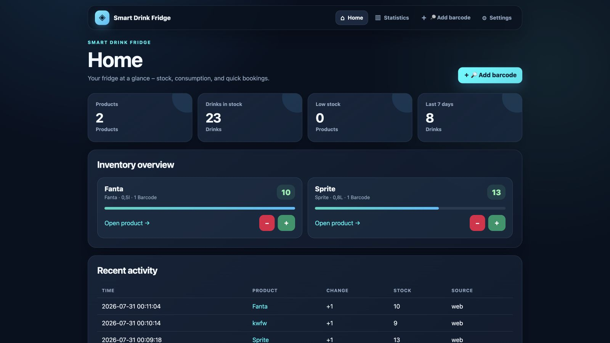
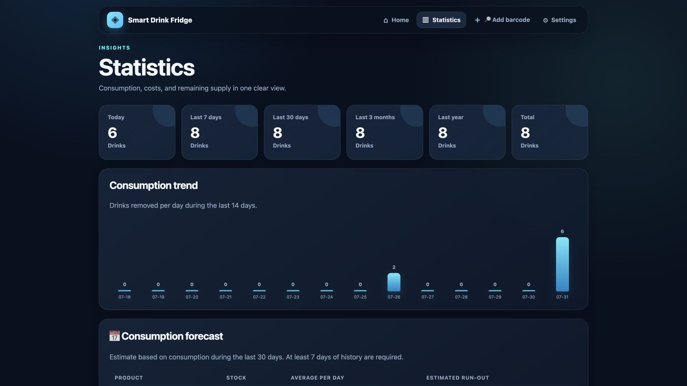
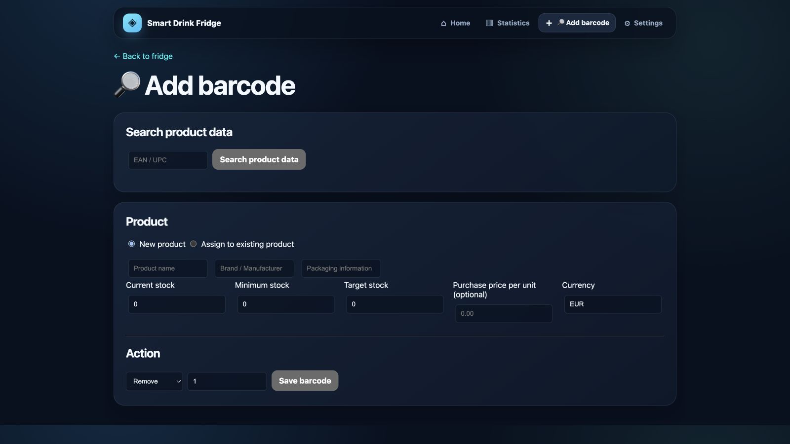
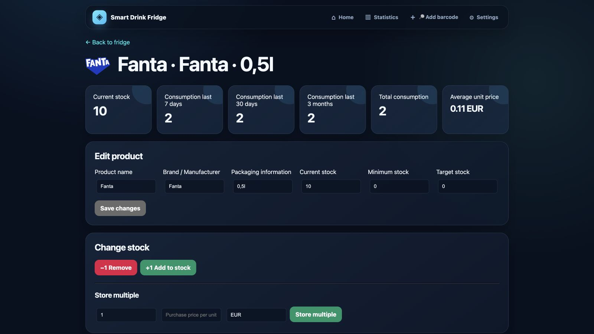
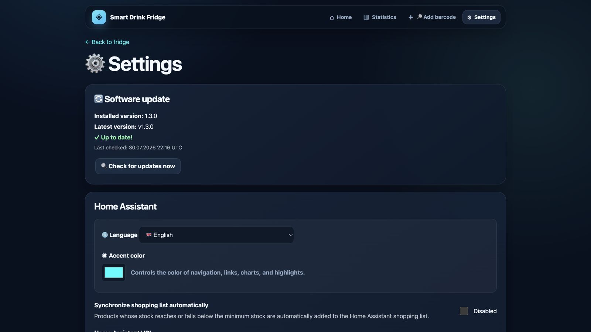
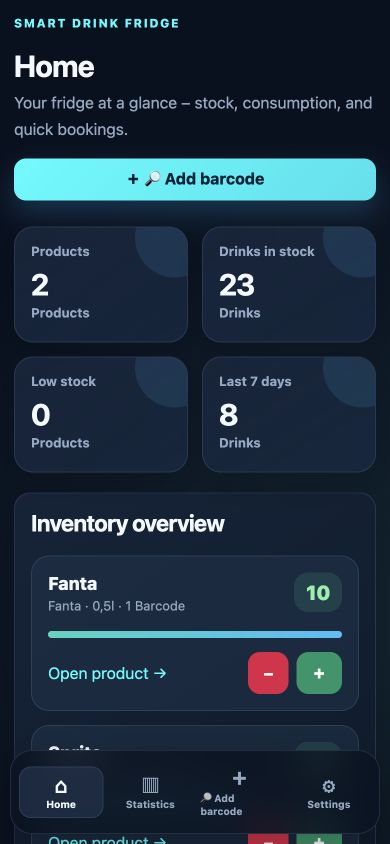
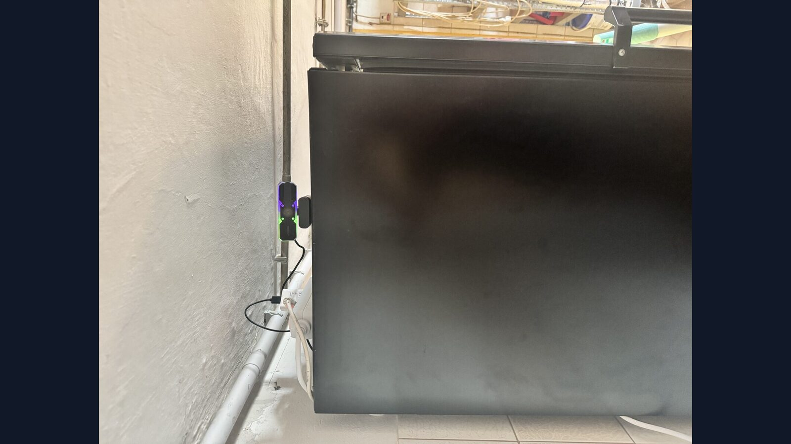
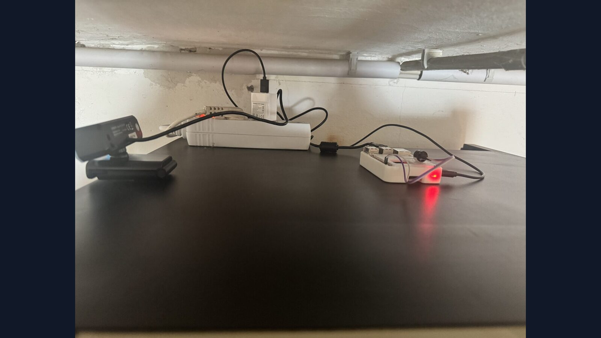

# Smart Drink Fridge

Smart Drink Fridge is a Raspberry Pi based inventory system for a drink fridge.

The idea is simple:

Add your drinks once and assign their EAN/barcodes to the system.

Whenever you take a bottle or can from the fridge, hold the barcode in front of the camera. The scanner detects the barcode, updates the stock automatically and stores the transaction with a timestamp.

The current stock, transaction history and statistics can be viewed through the local web interface.

Everything runs locally. No cloud service is required and all data stays on your own device.

---

## Table of Contents

- [Highlights](#highlights)
- [Screenshots](#screenshots)
- [Why?](#why)
- [Features](#features)
- [Integrations](#integrations)
- [Hardware](#hardware)
- [Quick Start](#quick-start)
- [Docker](#docker)
- [Camera](#camera)
- [GPIO Buzzer](#optional-gpio-buzzer)
- [Database](#database)
- [Home Assistant](#home-assistant)
- [Pushover](#pushover-notifications)
- [Security](#security)
- [Remote Access](#remote-access)
- [Project Status](#project-status)
- [Changelog](#changelog)
- [Support](#support)
- [License](#license)

---

## Highlights

- Camera-based barcode scanning
- Automatic stock tracking
- Support for single items and multipacks
- Multiple barcodes per product
- Automatic product lookup using Open Food Facts
- Home Assistant shopping list synchronization
- Optional Pushover notifications
- Optional Tailscale remote access
- Docker support
- SQLite database

---

## Screenshots

### Dashboard



### Statistics



### Add Barcode



### Product Details



### Settings and Accent Color



### Mobile Dashboard



### Real Installation



### Hardware Detail



---

## Why?

The project was originally built for my own drink fridge.

The goal was to make inventory management as simple as possible. Instead of manually updating a list, all you have to do is scan the barcode when taking a bottle or can from the fridge.

The inventory is updated automatically and every transaction is stored with a timestamp.

Over time the project grew with additional features like multipack support, Home Assistant integration and consumption statistics.


## Features

## Roadmap

See the [Roadmap](ROADMAP.md) for planned features and upcoming improvements.

### Barcode scanning

- Barcode scanning using a camera
- Buzzer feedback after a successful scan
- Password-protected cancellation of scanner transactions
- Correct cancellation of multi-item transactions

### Inventory management

- Automatic stock tracking
- Transaction history with timestamps
- Product-based transaction history across multiple barcodes
- Add multiple bottles or cans to stock at once
- Consumption statistics for different time periods
- Consumption forecast with estimated run-out dates per product
- Optional purchase prices with per-booking currency
- Currency dropdown with unambiguous symbols such as EUR (€), AUD (A$), and USD ($)
- Financial statistics grouped by currency without invalid exchange-rate totals

### Products and barcodes

- Multiple barcodes per product
- Different actions and quantities per barcode
- Automatic stock updates for single items and multipacks
- Automatic product lookup using Open Food Facts
- Editable product name, manufacturer/brand and packaging information
- Reassign existing barcodes to another product
- Merge duplicate products including their stock and barcodes


### Integrations

- Home Assistant shopping list synchronization
- Optional Pushover notifications
- Optional secure remote access using Tailscale
- Update checker located in Settings with a manual refresh action
- Optional one-click updates for Docker installations

### Web interface

- Current stock overview
- Product and barcode management
- Transaction history
- Consumption statistics
- Responsive phone, tablet, and desktop layout
- Installable Progressive Web App (PWA)
- Live Raspberry Pi, Docker container, camera, storage, and database status
- Optional user accounts with PIN/password and RFID authentication
- Personal 30-day consumption and cost tracking
- Assignment of previously unassigned bookings to users
- German, English, and French interface

### Optional user accounts and RFID

User accounts are disabled by default. The application continues to work
without a login until an administrator explicitly enables the feature under
**Settings → User accounts**. Enabling it requires the existing
`STORNO_PASSWORT`, preventing another network user from locking the owner out.

Passwords and PINs use a one-way password hash. RFID identifiers are stored as
keyed hashes and are never saved in their original form. RFID tags should still
be treated as a convenience, not as a high-security authentication factor,
because many inexpensive tags can be copied.

An administrator can create users, assign the `User` or `Administrator` role,
and optionally scan a USB RFID tag into the account form. Unassigned scanner
and web removals can be assigned to a user later. Each user receives a personal
30-day consumption and cost overview.

Keyboard-style RFID readers can be used directly on the web login page. A
headless Raspberry Pi can use a PC/SC NFC reader such as the tested
**ACS ACR122U** through the optional NFC service. Start web, camera scanner,
and NFC reader with:

```bash
docker compose --profile scanner --profile nfc up -d
```

The NFC service receives access to `/dev/bus/usb` and therefore runs only when
the `nfc` profile is explicitly selected. Scanning a known card activates that
user for 120 seconds or until the next camera barcode removal. If no user is
selected, the booking remains unassigned and can be assigned later from the
web interface.

Administrators can optionally enable **Block drink scans without a selected
user** in the user-account settings. This rule is off by default. When user
accounts are disabled, anonymous scanning continues to work and the rule is
automatically disabled.

---

## Hardware

The project was originally built using a Raspberry Pi and a USB camera.

You will need:

- Raspberry Pi or another compatible Linux system
- 1080p USB camera
- Optional GPIO buzzer
- Network connection

A 1080p USB camera is recommended for reliable barcode detection. During development, the lower-resolution Raspberry Pi camera did not provide sufficient image quality for reliable barcode scanning.

### Optional GPIO Buzzer

The buzzer provides audible feedback after a successful or failed barcode scan.

Connect it as follows:

| Raspberry Pi Pin | Buzzer |
|------------------|--------|
| GPIO 17 (BCM) / Physical Pin 11 | Positive (+) |
| GND / Physical Pin 9 (or any GND pin) | Negative (-) |

The GPIO pin can be changed in `scanner.py` if required.
---

## Quick Start

Clone the repository:

```bash
git clone https://github.com/DerRobin99/smart-drink-fridge.git
cd smart-drink-fridge
```

Create your configuration file:

```bash
cp .env.example .env
```

Edit `.env` and configure the options you want to use.

Start the web interface:

```bash
docker compose up -d
```

To also start the barcode scanner with camera and optional GPIO buzzer support:

```bash
docker compose --profile scanner up -d
```

The web interface is then available at:

```
http://YOUR-RASPBERRY-PI-IP:5000
```

The database is created automatically on the first start.


---

## Docker

The project is designed to run with Docker Compose.

### Containers

| Container | Description |
|-----------|-------------|
| **web** | Web interface and API |
| **scanner** | Camera barcode scanner (optional profile) |

---

### First start

Copy the example configuration:

```bash
cp .env.example .env
```

Adjust the values inside `.env` to match your environment before starting the containers.


Start only the web interface:

```bash
docker compose up -d
```

Start the web interface together with the barcode scanner:

```bash
docker compose --profile scanner up -d
```

View the logs:

```bash
docker compose logs -f
```

Stop all containers:

```bash
docker compose down
```

The SQLite database is stored in the persistent Docker volume and is automatically reused after updates.

### Updates from the web interface

The update status is shown only under **Settings → Software update**. Opening
other pages does not contact GitHub. In Settings, **Check for updates now**
forces a fresh release check.

For Docker Compose installations, an available release can optionally be
installed with one click. The updater pulls the current
`ghcr.io/derrobin99/smart-drink-fridge:latest` image and lets Watchtower
recreate only the web container while retaining its volumes, environment,
ports, and restart policy.

This feature is disabled by default and the normal Compose file does **not**
mount the Docker socket. After reading the warning below, enable the dedicated
override file:

```bash
docker compose -f docker-compose.yml -f docker-compose.updates.yml up -d
```

> **Security warning:** One-click updates require
> `/var/run/docker.sock` inside the web container. Access to this socket is
> effectively root access to the Docker host. Enable it only on a trusted
> private network, use a strong `SECRET_KEY`, never expose the application
> directly to the public internet, and restrict access with Tailscale or
> another VPN. If you do not need one-click updates, use the normal
> `docker compose up -d` command without `docker-compose.updates.yml`.

The install button appears only when all safety prerequisites are detected:
the feature is enabled, the Docker socket is available, and the running web
container uses the official GHCR image. Locally built or non-Docker
installations keep the check/download-link workflow and never show the install
button. During installation the web interface is briefly unavailable.


---

## Camera

A 1080p USB camera is recommended for reliable barcode detection.

The Raspberry Pi Camera Module was tested during development but did not provide reliable scanning results.

The default Docker configuration expects a camera at:

/dev/video0

Multiple barcodes can be assigned to the same product and removed individually when they are no longer needed.

---

## Database

Smart Drink Fridge uses SQLite.

The database is created automatically during the first startup and stored persistently inside the Docker volume.

No additional database server is required.

Product deletion does not remove historical bookings, so consumption statistics remain available.

---

## Home Assistant

Smart Drink Fridge can automatically synchronize products with a Home Assistant shopping list.

When the stock of a product reaches the configured minimum quantity, it is added to the shopping list automatically.

When the stock rises above the minimum again, the item is removed automatically.

Deleted products are automatically removed from the Home Assistant shopping list when synchronization is enabled.

---

## Pushover Notifications

Pushover support is optional.

If configured, the system sends a notification when the stock of a product changes from **4 to 3**, indicating that the minimum stock level has been reached.

Configure your credentials in `.env`:

```env
PUSHOVER_USER=your_user_key
PUSHOVER_TOKEN=your_application_token
```

If you do not want to use Pushover, simply leave these values empty.
---

## Security

Smart Drink Fridge is designed to run inside a trusted home network.

If remote access is required, using Tailscale or a VPN is recommended instead of exposing the web interface directly to the internet.

---

## Remote Access

Remote access is optional.

The recommended solution is Tailscale, which provides secure encrypted access to your Raspberry Pi without opening ports on your router.

This allows you to access the web interface from anywhere while keeping your home network protected.

### One-switch HTTPS for phones and installed apps

Tailscale can automatically provide a trusted HTTPS certificate and private
`.ts.net` address. No certificate files, router ports, or reverse proxy are
required.

Configure `.env`:

```env
TAILSCALE_ENABLED=true
TAILSCALE_AUTHKEY=your-tailscale-auth-key
TAILSCALE_HOSTNAME=smart-drink-fridge
TAILSCALE_HTTPS=true
```

Then start the application:

```bash
./start.sh
```

The script starts Tailscale, waits until it is connected, enables Tailscale
Serve on HTTPS port 443, and prints the final `https://...ts.net` address.
Open that address on a phone connected to the same tailnet.

If Tailscale is already installed on the host, the script uses that existing
connection automatically. Otherwise, it starts the bundled Tailscale Docker
profile. This avoids running two Tailscale clients on the same device.

If the host installation reports `Access denied` once, allow the current user
to manage Tailscale:

```bash
sudo tailscale set --operator="$USER"
./start.sh
```

On first use, Tailscale may print a one-time approval URL to enable HTTPS for
the tailnet. Open that URL, approve the feature, and run `./start.sh` again.
The Serve configuration then persists across restarts.

---

## Install as an App (PWA)

Smart Drink Fridge can be installed as a Progressive Web App on Android,
iPhone, iPad, Windows, macOS, Linux, and ChromeOS.

- Android and desktop Chrome/Edge: open the web interface and select
  **Install app**.
- iPhone and iPad: open the web interface in Safari, select **Share**, then
  **Add to Home Screen**.

PWA installation and offline support require a secure context. The easiest
option is the Tailscale HTTPS switch described above. Browsers do not
enable service workers for a plain HTTP address such as
`http://192.168.x.x:5000`.

The app uses a network-first strategy for pages containing stock data. The
most recently loaded pages remain available when the device is offline, while
online requests always prefer current inventory data.

---

## Project Status

The project is under active development.

New features, improvements and bug fixes are added regularly.

Feedback, bug reports and feature requests are always welcome.

---

## Changelog

### v1.3.3

- Added currency selection with ISO codes and clear currency symbols
- Added optional user accounts with PIN/password and RFID authentication
- Added personal consumption and cost tracking
- Added headless PC/SC NFC reader support, including the ACS ACR122U
- Added later assignment of unassigned bookings to users
- Added an optional rule to block scanner consumption without a selected user
- Kept user accounts, NFC identification, and scanner sign-in enforcement fully optional

### v1.3.2

- Added a live system dashboard for Raspberry Pi and Docker installations
- Added CPU temperature, memory, storage, uptime, load, and database metrics
- Added Web, scanner, Tailscale, and camera status monitoring
- Added automatic 15-second dashboard refresh and responsive system cards

### v1.3.1

- Introduced a modern responsive interface with dedicated desktop and mobile navigation
- Added dashboard KPIs, product cards, stock indicators, and a 14-day consumption trend
- Added a configurable interface accent color in Settings
- Improved mobile layouts throughout the application
- Updated the README with current English desktop and mobile screenshots
- Refreshed the PWA cache so installed applications receive the new interface
- Added visible one-click update progress and protected running updates from repeated clicks

### v1.3.0

- Added per-product consumption forecasts based on the last 30 days
- Added purchase prices, multi-currency entry, and financial statistics
- Added an installable responsive PWA and Tailscale HTTPS setup
- Moved update management to Settings with manual checks and optional Docker updates
- Completed German, English, and French interface translations

### v1.2.7

- Fixed backup creation failing because the translation function was not imported

### v1.2.6

- Product deletion while preserving booking history and statistics
- Individual barcode deletion
- Option to show or hide products with zero stock
- Complete German, English and French translations
- Refactored the codebase into modular route, service and utility modules
- Various bug fixes and improvements

### v1.2.5

- Added missing translations on the product details page
- Added translations for consumption statistics
- Added translations for product editing and stock management
- Added translations for assigned barcodes and booking history
- Completed German, English and French translations for the affected areas
- Improved multilingual support across the product management interface
- Fixed raw translation keys being displayed in newly translated elements

### v1.2.4

- Backup system (create, restore, download, and delete backups)
- Language system migrated to .lang files
- Added French translation
- Automatic product lookup using Open Food Facts
- Various bug fixes and improvements

### v1.2.3

- English translations for the Home Assistant settings page
- Added missing translations for minimum stock and target stock
- Fixed translation rendering on the Home Assistant configuration page
- Fixed multi-line Home Assistant description translation
- Various translation and UI improvements

### v1.2.2

- Manufacturer logo lookup
- Product card redesign
- Improved Open Food Facts integration
- Better product editing
- Various bug fixes and UI improvements

### v1.2.1

- Product merge
- Reassign barcodes between products
- Improved transaction history
- Better multipack support
- Various bug fixes

---

## Support

If you like this project and would like to support its development, you can buy me a coffee or make a donation using one of the following cryptocurrencies.

### Bitcoin (BTC)

`bc1qvmjpzz2h4wvl3z567d38p9jf2wuw3l5jegnyd9`

### Ethereum (ETH)

`0xa65cCd30AD34c2CD312de2f34409474b82b60Aab`

### Solana (SOL)

`81cWeiuwBcqSX33m83ELqxdqDbeBcke6o2MNCxeSND8p`

Contributions, bug reports and feature requests are always appreciated.

---

## License

This project is licensed under the MIT License.
