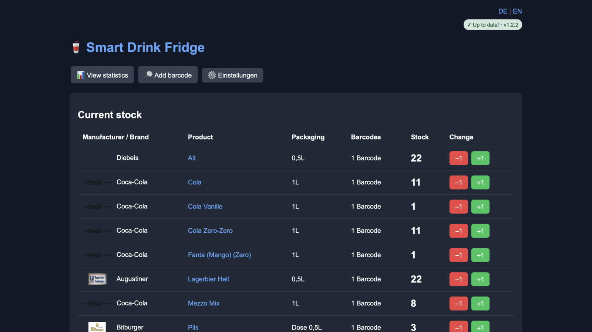
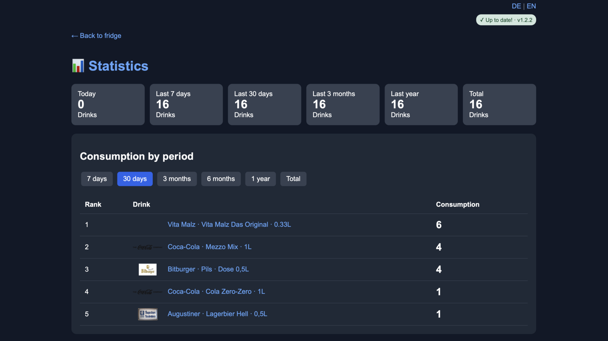
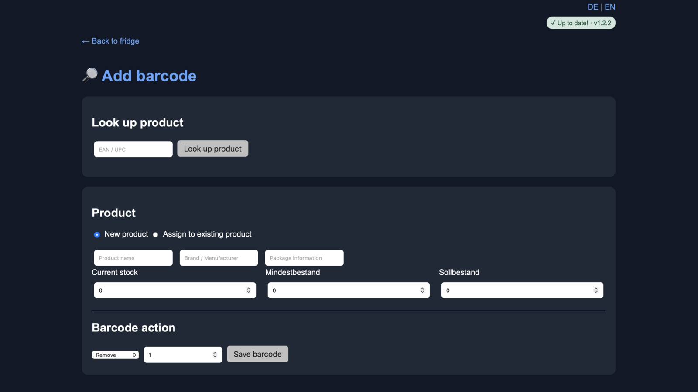

# Smart Drink Fridge

Smart Drink Fridge is a Raspberry Pi based inventory system for a drink fridge.

The idea is simple:

Add your drinks once and assign their EAN/barcodes to the system.

Whenever you take a bottle or can from the fridge, hold the barcode in front of the camera. The scanner detects the barcode, updates the stock automatically and stores the transaction with a timestamp.

The current stock, transaction history and statistics can be viewed through the local web interface.

Everything runs locally. No cloud service is required and all data stays on your own device.

---

## Table of Contents

- [Highlights](#highlights)
- [Screenshots](#screenshots)
- [Why?](#why)
- [Features](#features)
- [Integrations](#integrations)
- [Hardware](#hardware)
- [Quick Start](#quick-start)
- [Docker](#docker)
- [Camera](#camera)
- [GPIO Buzzer](#optional-gpio-buzzer)
- [Database](#database)
- [Home Assistant](#home-assistant)
- [Pushover](#pushover-notifications)
- [Security](#security)
- [Remote Access](#remote-access)
- [Project Status](#project-status)
- [Changelog](#changelog)
- [Support](#support)
- [License](#license)

---

## Highlights

- Camera-based barcode scanning
- Automatic stock tracking
- Support for single items and multipacks
- Multiple barcodes per product
- Automatic product lookup using Open Food Facts
- Home Assistant shopping list synchronization
- Optional Pushover notifications
- Optional Tailscale remote access
- Docker support
- SQLite database

---

## Screenshots

### Dashboard



### Statistics



### Add Barcode



### Real Installation


### Hardware Detail


---

## Why?

The project was originally built for my own drink fridge.

The goal was to make inventory management as simple as possible. Instead of manually updating a list, all you have to do is scan the barcode when taking a bottle or can from the fridge.

The inventory is updated automatically and every transaction is stored with a timestamp.

Over time the project grew with additional features like multipack support, Home Assistant integration and consumption statistics.


## Features

## Roadmap

See the [Roadmap](ROADMAP.md) for planned features and upcoming improvements.

### Barcode scanning

- Barcode scanning using a camera
- Buzzer feedback after a successful scan
- Password-protected cancellation of scanner transactions
- Correct cancellation of multi-item transactions

### Inventory management

- Automatic stock tracking
- Transaction history with timestamps
- Product-based transaction history across multiple barcodes
- Add multiple bottles or cans to stock at once
- Consumption statistics for different time periods

### Products and barcodes

- Multiple barcodes per product
- Different actions and quantities per barcode
- Automatic stock updates for single items and multipacks
- Automatic product lookup using Open Food Facts
- Editable product name, manufacturer/brand and packaging information
- Reassign existing barcodes to another product
- Merge duplicate products including their stock and barcodes


### Integrations

- Home Assistant shopping list synchronization
- Optional Pushover notifications
- Optional secure remote access using Tailscale
- Optional GitHub update checker with update notifications

### Web interface

- Current stock overview
- Product and barcode management
- Transaction history
- Consumption statistics
- German and English interface

---

## Hardware

The project was originally built using a Raspberry Pi and a USB camera.

You will need:

- Raspberry Pi or another compatible Linux system
- 1080p USB camera
- Optional GPIO buzzer
- Network connection

A 1080p USB camera is recommended for reliable barcode detection. During development, the lower-resolution Raspberry Pi camera did not provide sufficient image quality for reliable barcode scanning.

### Optional GPIO Buzzer

The buzzer provides audible feedback after a successful or failed barcode scan.

Connect it as follows:

| Raspberry Pi Pin | Buzzer |
|------------------|--------|
| GPIO 17 (BCM) / Physical Pin 11 | Positive (+) |
| GND / Physical Pin 9 (or any GND pin) | Negative (-) |

The GPIO pin can be changed in `scanner.py` if required.
---

## Quick Start

Clone the repository:

```bash
git clone https://github.com/DerRobin99/smart-drink-fridge.git
cd smart-drink-fridge
```

Create your configuration file:

```bash
cp .env.example .env
```

Edit `.env` and configure the options you want to use.

Start the web interface:

```bash
docker compose up -d
```

To also start the barcode scanner with camera and optional GPIO buzzer support:

```bash
docker compose --profile scanner up -d
```

The web interface is then available at:

```
http://YOUR-RASPBERRY-PI-IP:5000
```

The database is created automatically on the first start.


---

## Docker

The project is designed to run with Docker Compose.

### Containers

| Container | Description |
|-----------|-------------|
| **web** | Web interface and API |
| **scanner** | Camera barcode scanner (optional profile) |

---

### First start

Copy the example configuration:

```bash
cp .env.example .env
```

Adjust the values inside `.env` to match your environment before starting the containers.


Start only the web interface:

```bash
docker compose up -d
```

Start the web interface together with the barcode scanner:

```bash
docker compose --profile scanner up -d
```

View the logs:

```bash
docker compose logs -f
```

Stop all containers:

```bash
docker compose down
```

The SQLite database is stored in the persistent Docker volume and is automatically reused after updates.


---

## Camera

A 1080p USB camera is recommended for reliable barcode detection.

The Raspberry Pi Camera Module was tested during development but did not provide reliable scanning results.

The default Docker configuration expects a camera at:

/dev/video0

---

## Database

Smart Drink Fridge uses SQLite.

The database is created automatically during the first startup and stored persistently inside the Docker volume.

No additional database server is required.

---

## Home Assistant

Smart Drink Fridge can automatically synchronize products with a Home Assistant shopping list.

When the stock of a product reaches the configured minimum quantity, it is added to the shopping list automatically.

When the stock rises above the minimum again, the item is removed automatically.

---

## Pushover Notifications

Pushover support is optional.

If configured, the system sends a notification when the stock of a product changes from **4 to 3**, indicating that the minimum stock level has been reached.

Configure your credentials in `.env`:

```env
PUSHOVER_USER=your_user_key
PUSHOVER_TOKEN=your_application_token
```

If you do not want to use Pushover, simply leave these values empty.
---

## Security

Smart Drink Fridge is designed to run inside a trusted home network.

If remote access is required, using Tailscale or a VPN is recommended instead of exposing the web interface directly to the internet.

---

## Remote Access

Remote access is optional.

The recommended solution is Tailscale, which provides secure encrypted access to your Raspberry Pi without opening ports on your router.

This allows you to access the web interface from anywhere while keeping your home network protected.

---

## Project Status

The project is under active development.

New features, improvements and bug fixes are added regularly.

Feedback, bug reports and feature requests are always welcome.

---

## Changelog


### v1.2.4

- Backup-System (Erstellen, Wiederherstellen, Herunterladen und Löschen)
- Sprachsystem auf `.lang`-Dateien umgestellt
- Französische Übersetzung hinzugefügt
- Automatische Produktsuche über Open Food Facts
- Diverse Fehlerbehebungen und Verbesserungen

### v1.2.3

- English translations for the Home Assistant settings page
- Added missing translations for minimum stock and target stock
- Fixed translation rendering on the Home Assistant configuration page
- Fixed multi-line Home Assistant description translation
- Various translation and UI improvements

### v1.2.2

- Manufacturer logo lookup
- Product card redesign
- Improved Open Food Facts integration
- Better product editing
- Various bug fixes and UI improvements

### v1.2.1

- Product merge
- Reassign barcodes between products
- Improved transaction history
- Better multipack support
- Various bug fixes

---

## Support

If you like this project and would like to support its development, you can buy me a coffee or make a donation using one of the following cryptocurrencies.

### Bitcoin (BTC)

`bc1qvmjpzz2h4wvl3z567d38p9jf2wuw3l5jegnyd9`

### Ethereum (ETH)

`0xa65cCd30AD34c2CD312de2f34409474b82b60Aab`

### Solana (SOL)

`81cWeiuwBcqSX33m83ELqxdqDbeBcke6o2MNCxeSND8p`

Contributions, bug reports and feature requests are always appreciated.

---

## License

This project is licensed under the MIT License.
